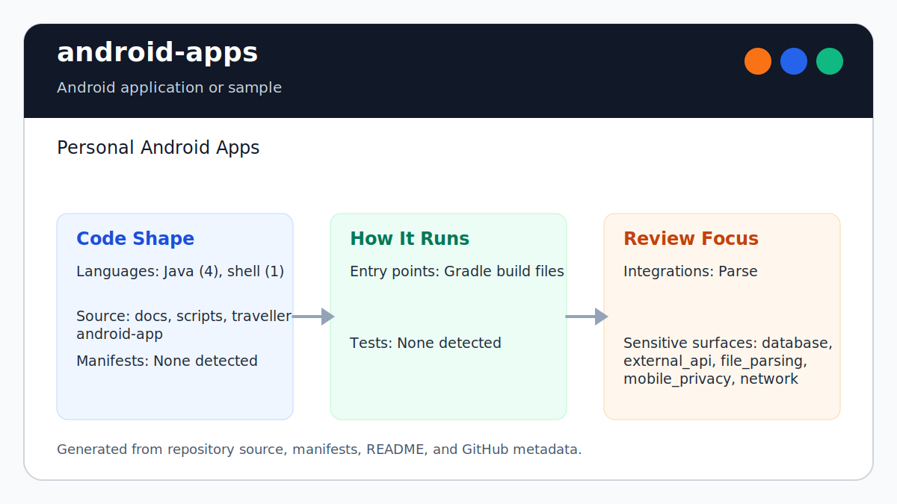

# android-apps

<!-- README-OVERVIEW-IMAGE -->


## Overview

`garethpaul/android-apps` is an Android application or sample. Personal Android Apps

This README is based on the checked-in source, manifests, scripts, and repository metadata on the `master` branch. The project language mix found during review was: Java (4), shell (1).

## Repository Contents

- `README.md` - project overview and local usage notes
- `docs` - source or example code
- `scripts` - source or example code
- `SECURITY.md` - security reporting and disclosure guidance
- `traveller-android-app` - source or example code
- `VISION.md` - project direction and maintenance guardrails

Additional scan context:

- Source directories: docs, scripts, traveller-android-app
- Dependency and build manifests: none detected
- Entry points or build surfaces: Gradle build files
- Test-looking files: no obvious test files detected

## Getting Started

### Prerequisites

- Git
- Android Studio or a compatible Android SDK
- Gradle or the checked-in Gradle wrapper when present

### Setup

```bash
git clone https://github.com/garethpaul/android-apps.git
cd android-apps
make check
scripts/check-baseline.sh
scripts/prepare-traveller-constants.sh
cd traveller-android-app
./gradlew lint --no-daemon
./gradlew check --no-daemon
./gradlew assembleDebug --no-daemon
```

The setup commands above are derived from repository files. Legacy mobile, Python, or JavaScript samples may require older SDKs or package versions than a modern workstation uses by default.

## Running or Using the Project

- Use Android Studio to open the project or run `gradle assembleDebug` when the Android SDK is configured.

## Testing and Verification

- `make check` - repository-standard wrapper around the SDK-free Traveller baseline checks
- `scripts/check-baseline.sh` - runs SDK-free Traveller baseline checks
- From `traveller-android-app/`, run `./gradlew lint --no-daemon`, `./gradlew check --no-daemon`, and `./gradlew assembleDebug --no-daemon` when the Android SDK is configured

When the required SDK or runtime is unavailable, use static checks and source review first, then verify on a machine that has the matching platform toolchain.

## Configuration and Secrets

- Detected references to Parse. Keep API keys, OAuth credentials, tokens, and account-specific values in local configuration only.
- Traveller is pinned to Android build-tools 24.0.3 for this legacy baseline.
- Copy `Constants.java.example` with `scripts/prepare-traveller-constants.sh`, then replace placeholder Parse values locally. `Constants.java` must stay ignored.

## Security and Privacy Notes

- Review changes touching external API calls or credential-adjacent configuration; examples from the scan include traveller-android-app/traveller/src/main/java/com/requestlabs/traveller/App.java.
- Review changes touching network requests, sockets, or service endpoints; examples from the scan include scripts/check-baseline.sh, traveller-android-app/build.gradle, traveller-android-app/gradle.properties, traveller-android-app/traveller/proguard-rules.txt, and 4 more.
- Review changes touching mobile permissions or privacy-sensitive device data; examples from the scan include docs/plans/2026-06-08-traveller-android-reproducibility-baseline.md, traveller-android-app/gradlew, traveller-android-app/traveller/src/main/AndroidManifest.xml.
- Review changes touching file, media, JSON, XML, CSV, OCR, or data parsing; examples from the scan include docs/plans/2026-06-08-traveller-android-reproducibility-baseline.md, scripts/check-baseline.sh, traveller-android-app/traveller/build.gradle, traveller-android-app/traveller/lint.xml, and 6 more.
- Review changes touching database, model, or persistence code; examples from the scan include docs/plans/2026-06-08-traveller-android-reproducibility-baseline.md.

## Maintenance Notes

- This looks like a legacy Android project or sample. Expect Android SDK, Gradle, and support-library versions to matter.
- See `CHANGES.md` and `docs/plans/2026-06-08-traveller-constants-helper.md`
  for the current constants-helper baseline.
- See `SECURITY.md` for vulnerability reporting and safe research guidance.
- See `VISION.md` for project direction and contribution guardrails.

## Contributing

Keep changes small and tied to the project that is already present in this repository. For code changes, document the toolchain used, avoid committing generated dependency directories or local configuration, and update this README when setup or verification steps change.
