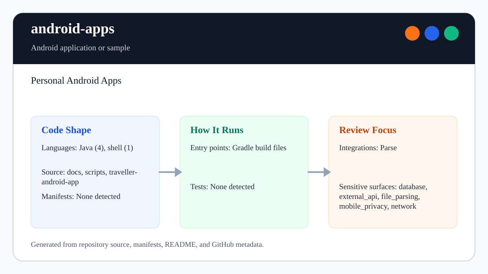

# android-apps

<!-- README-OVERVIEW-IMAGE -->


## Overview

`garethpaul/android-apps` is an Android application or sample. Personal Android Apps

This README is based on the checked-in source, manifests, scripts, and repository metadata on the `master` branch. The project language mix found during review was: Java (4), shell (1).

## Repository Contents

- `README.md` - project overview and local usage notes
- `.github/workflows/check.yml` - CI baseline that runs the root Make gate
- `docs` - source or example code
- `scripts` - source or example code
- `SECURITY.md` - security reporting and disclosure guidance
- `traveller-android-app` - source or example code
- `VISION.md` - project direction and maintenance guardrails

Additional scan context:

- Source directories: docs, scripts, traveller-android-app
- Dependency and build manifests: none detected
- Entry points or build surfaces: Gradle build files
- Test-looking files: no obvious test files detected

## Getting Started

### Prerequisites

- Git
- JDK 8 or newer for the dependency-free JVM test
- Android Studio or a compatible Android SDK
- Gradle or the checked-in Gradle wrapper when present

### Setup

```bash
git clone https://github.com/garethpaul/android-apps.git
cd android-apps
make check
make lint
make test
make build
scripts/check-baseline.sh
scripts/prepare-traveller-constants.sh
scripts/verify-gradle-wrapper.sh
scripts/test-constants-generation.sh
scripts/test-gradle-toolchain.sh
scripts/test-gradle-wrapper-authentication.sh
cd traveller-android-app
./gradlew lint --no-daemon
./gradlew check --no-daemon
./gradlew assembleDebug --no-daemon
```

The setup commands above are derived from repository files. Legacy mobile, Python, or JavaScript samples may require older SDKs or package versions than a modern workstation uses by default.

Traveller's Gradle `preBuild` creates a local placeholder `Constants.java` from
`Constants.java.example` when the file is missing. The same idempotent setup can
be run directly with `scripts/prepare-traveller-constants.sh`. Neither path
overwrites an existing local file; replace both placeholder Parse values before
starting the application because startup rejects unchanged placeholders.

## Running or Using the Project

- Use Android Studio to open the project or run `gradle assembleDebug` when the Android SDK is configured.

## Testing and Verification

- `make lint` - checks shell script syntax and runs the SDK-free Traveller baseline checks
- `make test` - verifies the fail-closed build gate, idempotent constants
  generation, and dependency-free JVM behavior for task-description normalization
- `make build` - requires an Android SDK, then runs legacy Traveller Android
  lint and debug APK assembly; Gradle creates missing local placeholder constants
  through `preBuild`, and unavailable SDK tooling fails the gate
- `make check` - repository-standard wrapper around `make lint`, `make test`, and `make build`
- `scripts/check-baseline.sh` - runs SDK-free Traveller baseline checks
- `scripts/verify-gradle-wrapper.sh` - mirrors the hosted Gradle wrapper digest
  check for local drift detection before Make invokes Gradle
- `scripts/test-constants-generation.sh` - verifies placeholder creation and
  proves existing local credentials are not overwritten
- `scripts/test-gradle-toolchain.sh` - verifies the hosted workflow pairs the
  Gradle 1.10 wrapper and Android Gradle Plugin 0.8.3 with Java 7
- `scripts/test-gradle-wrapper-authentication.sh` - mutates `gradlew`, the
  wrapper jar, and wrapper properties to verify wrapper authentication rejects
  replacements and restorations before Gradle execution
- The baseline check also protects source-level contracts for Traveller row
  inflation, Parse subclass registration, and task input normalization.
- The task-description behavior test compiles only the pure normalizer and its
  test into a temporary directory; it does not require Android or Parse.
- From `traveller-android-app/`, run `./gradlew lint --no-daemon`, `./gradlew check --no-daemon`, and `./gradlew assembleDebug --no-daemon` when the Android SDK is configured
- GitHub Actions first authenticates the committed Gradle wrapper launcher, jar,
  and properties with an inline `/usr/bin/sha256sum --strict --check` step after
  checkout. That inline workflow step is the hosted authority; Make's verifier
  only mirrors it for local checks and is not a security boundary for
  pull-request-authored repository code. After authentication, GitHub Actions
  sets up Zulu Java 7, provisions Android API 19 and build-tools 24.0.3, then
  runs the same root `make check` gate through
  `.github/workflows/check.yml` on pushes, pull requests, and manual runs with
  pinned checkout, read-only permissions, a fixed Ubuntu 24.04 runner,
  superseded-run cancellation, and a 15-minute timeout.

When the required SDK or runtime is unavailable, use static checks and source review first, then verify on a machine that has the matching platform toolchain.

Use [`DEVICE_VERIFICATION.md`](DEVICE_VERIFICATION.md) for the exact-commit
emulator/device and non-production Parse matrix. It covers configuration,
cache/network queries, optimistic saves, concurrent callbacks, lifecycle,
offline failures, privacy-safe evidence, and explicit unexecuted rows.

## Configuration and Secrets

- Detected references to Parse. Keep API keys, OAuth credentials, tokens, and account-specific values in local configuration only.
- Traveller is pinned to Android build-tools 24.0.3 for this legacy baseline.
- Gradle `preBuild` or `scripts/prepare-traveller-constants.sh` copies
  `Constants.java.example` only when the local file is missing. Replace the
  placeholder Parse values locally; `Constants.java` must stay ignored.
- Changes to the reviewed Gradle wrapper digests are security-sensitive because
  hosted validation rejects unreviewed replacements before any repository-owned
  script, SDK setup, Java setup, or Make command runs.
- Traveller fails before `Parse.initialize` when either local Parse value is
  blank or still matches the checked-in template placeholder. The diagnostic
  never includes configured credential values.
- Traveller preserves the Android `Application` lifecycle by calling
  `super.onCreate()` before configuration validation and Parse initialization.
- Traveller trims task descriptions and rejects whitespace-only entries before
  saving Parse `Item` records.
- Traveller removes ASCII and Unicode boundary whitespace before rejecting empty task descriptions.
- Traveller treats a missing task input view as an empty description so stale
  layouts do not crash task creation.
- Traveller ignores item toggle events when the adapter, selected item, row
  view, or row text view is unavailable or malformed.
- Traveller ignores item toggle events whose adapter position is outside the
  current list bounds.
- Traveller updates task rows in place after queued Parse saves instead of
  finishing and restarting the activity for each create or toggle action.
- Traveller row rendering tolerates missing items, missing descriptions, and
  malformed row text views without crashing the list adapter.
- Traveller disables Android backup in the checked-in manifest so local Parse
  state is not included in platform backups by default.
- Traveller suppresses the expected cache-miss callback while
  `CACHE_THEN_NETWORK` continues to the network. Real Parse task loading
  failures still show a localized error toast instead of silently leaving
  stale or empty list state.
- When `CACHE_THEN_NETWORK` first supplies usable cached results, cached tasks remain visible without a later network-error toast from the same query.
  Queries that fail before delivering tasks still show the localized error.
- Traveller reconciles optimistic task save failures by removing unsaved rows or
  restoring prior completion state before a guarded refresh.
- Traveller ignores stale save callbacks from earlier visible lifecycles before
  they can roll back or refresh a newly resumed adapter.
- Traveller accepts only the latest save callback for each task identity, so an
  older same-item failure cannot undo a newer optimistic save.
- Traveller reconciles independent optimistic save failures even when later
  unrelated task mutations occur; same-task supersession is owned by per-task
  save generations.
- Traveller refreshes incomplete items when `MainActivity` starts and ignores
  callbacks after the activity stops or a newer refresh supersedes them.
- Traveller optimistic mutations invalidate stale Parse query callbacks before
  adding a new row or applying a completion toggle.
- Traveller keeps application-owned Parse subclass registration before SDK
  initialization so activity recreation cannot repeat process-wide model setup.
- Traveller's explicit launcher export boundary is limited to `MainActivity`
  and coupled to the existing `MAIN`/`LAUNCHER` intent filter.
- Local IDE metadata stays ignored, including nested Android Studio project
  metadata, so editor workspace files do not become part of the shared
  Traveller baseline.

## Security and Privacy Notes

- Review changes touching external API calls or credential-adjacent configuration; examples from the scan include traveller-android-app/traveller/src/main/java/com/requestlabs/traveller/App.java.
- Review changes touching network requests, sockets, or service endpoints; examples from the scan include scripts/check-baseline.sh, traveller-android-app/build.gradle, traveller-android-app/gradle.properties, traveller-android-app/traveller/proguard-rules.txt, and 4 more.
- Review changes touching mobile permissions or privacy-sensitive device data; examples from the scan include docs/plans/2026-06-08-traveller-android-reproducibility-baseline.md, traveller-android-app/gradlew, traveller-android-app/traveller/src/main/AndroidManifest.xml.
- Review changes touching file, media, JSON, XML, CSV, OCR, or data parsing; examples from the scan include docs/plans/2026-06-08-traveller-android-reproducibility-baseline.md, scripts/check-baseline.sh, traveller-android-app/traveller/build.gradle, traveller-android-app/traveller/lint.xml, and 6 more.
- Review changes touching database, model, or persistence code; examples from the scan include docs/plans/2026-06-08-traveller-android-reproducibility-baseline.md.

## Maintenance Notes

- See `docs/plans/2026-06-14-traveller-device-verification-checklist.md` for
  the Android/Parse runtime evidence matrix and non-claims.

- This looks like a legacy Android project or sample. Expect Android SDK, Gradle, and support-library versions to matter.
- See `CHANGES.md` and `docs/plans/2026-06-08-traveller-constants-helper.md`
  for the current constants-helper baseline.
- See `docs/plans/2026-06-09-traveller-task-input-normalization.md` for the
  task input normalization contract.
- See `docs/plans/2026-06-16-traveller-task-description-jvm-test.md` for the
  executable task-description behavior boundary.
- See `docs/plans/2026-06-17-traveller-unicode-task-whitespace.md` for Unicode
  boundary-whitespace handling.
- See `docs/plans/2026-06-09-traveller-task-input-null-guard.md` for the task
  input null guard.
- See `docs/plans/2026-06-09-traveller-item-toggle-guards.md` for item-toggle
  null guards.
- See `docs/plans/2026-06-09-traveller-item-toggle-position-guard.md` for
  stale adapter-position guards.
- See `docs/plans/2026-06-09-traveller-item-row-rendering-guards.md` for item
  row rendering guards.
- See `docs/plans/2026-06-09-traveller-backup-policy.md` for the manifest
  backup policy contract.
- See `docs/plans/2026-06-09-traveller-parse-query-failures.md` for the task
  loading failure contract.
- See `docs/plans/2026-06-09-traveller-make-gate-targets.md` for the
  repository lint, test, and build target contract.
- See `docs/plans/2026-06-09-traveller-editor-metadata-ignore.md` for the
  local editor metadata ignore contract.
- See `docs/plans/2026-06-09-traveller-nested-editor-metadata-cleanup.md` for
  nested Android Studio metadata cleanup.
- See `docs/plans/2026-06-10-ci-baseline.md` for the lightweight CI baseline.
- See `docs/plans/2026-06-12-traveller-query-lifecycle.md` for visible-lifecycle
  refreshes and stale Parse callback suppression.
- See `docs/plans/2026-06-13-traveller-save-failure-reconciliation.md` for
  optimistic task save failures and adapter rollback.
- See `docs/plans/2026-06-13-traveller-optimistic-query-invalidation.md` for
  local mutation ordering and stale query suppression.
- See `SECURITY.md` for vulnerability reporting and safe research guidance.
- See `VISION.md` for project direction and contribution guardrails.

## Contributing

Keep changes small and tied to the project that is already present in this repository. For code changes, document the toolchain used, avoid committing generated dependency directories or local configuration, and update this README when setup or verification steps change.
